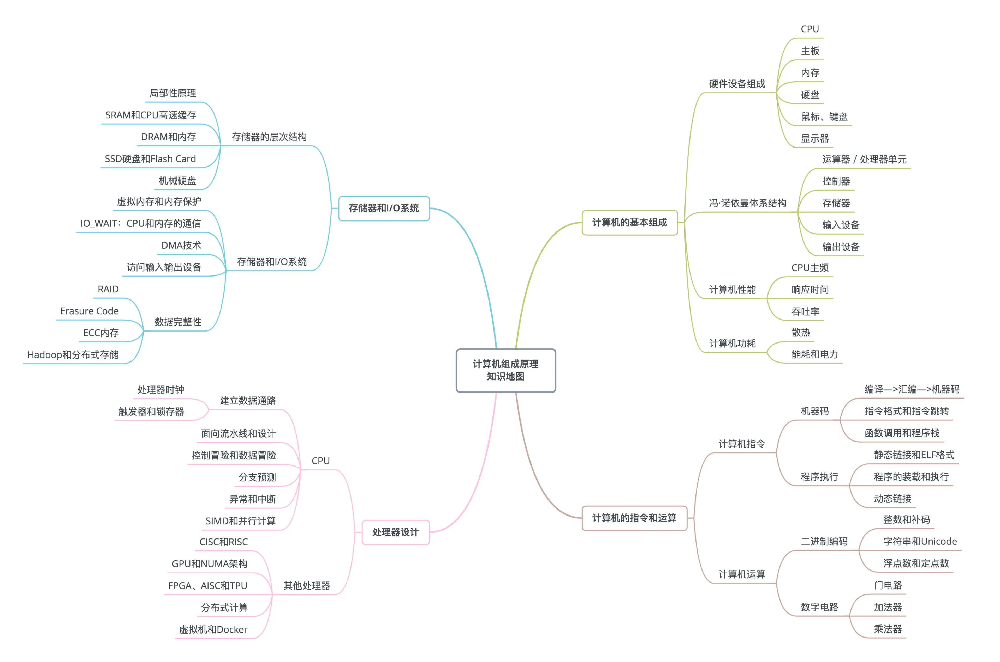

# 计算机组成原理（Computer Organization）

## 01 冯·诺伊曼体系结构

冯·诺依曼体系结构（Von Neumann architecture），也叫**存储程序**计算机。是“可编程”计算机和“存储”计算机。可阅读文档：[First Draft of a Report on the EDVAC](https://en.wikipedia.org/wiki/First_Draft_of_a_Report_on_the_EDVA)

计算机基本硬件组成：CPU、内存、主板（Motherboard）、电源、I/O 设备、显卡（Graphics Card）。

**任何一台计算机的任何一个部件都可以归到运算器、控制器、存储器、输入设备和输出设备中，而所有的现代计算机也都是基于这个基础架构来设计开发的。**

1. 一个包含算术逻辑单元（Arithmetic Logic Unit，ALU）和处理器寄存器（Processor Register）的**处理器单元**（Processing Unit），用来完成各种算术和逻辑运算。

2. 一个包含指令寄存器（Instruction Register）和程序计数器（Program Counter）的**控制器单元**（Control Unit/CU），用来控制程序的流程，通常就是不同条件下的分支和跳转。

3. 用来存储数据（Data）和指令（Instruction）的**内存**（memory），以及更大容量的外部存储，在过去，可能是磁带、磁鼓这样的设备，现在通常就是硬盘。

4. 各种**输入和输出设备**（I/O），以及对应的输入和输出机制。

------

由算术逻辑单元和控制器单元组成**中央处理器CPU**（Central Processing Unit），所有的**计算机程序**，也都可以抽象为从**输入设备**读取输入信息，通过**运算器**和**控制器**来执行存储在**存储器**里的程序，最终把结果输出到**输出设备**中。

## 02 计算机组成原理知识地图

计算机组成原理的知识点可分成了四大部分：**计算机的基本组成、计算机的指令和计算、处理器设计，以及存储器和 I/O 设备**。

## 10 动态链接

程序连接
